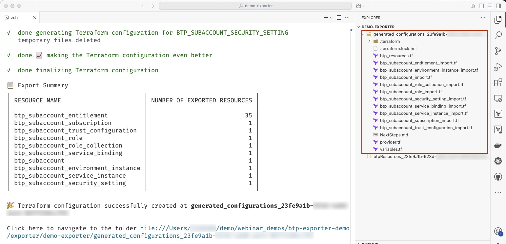

# Getting Started

The btptf CLI offers several commands for the export of Terraform configurations of SAP BTP. Currently the CLI supports exporting of SAP BTP resources like Subaccounts and directories. The CLI supports two ways to export BTP resources
- Exporting resources via JSON
- Exporting resources

### Exporting Resources via JSON
This is a two-step process where the JSON can be created manually or via `btptf create-json` command

1. Create a JSON file with a list of BTP resources that can be imported

```bash
btptf create-json - s <subaccount id>
```
Review and adapt the JSON file and remove resources which need not be imported.

2. Export resources from SAP BTP via a JSON file

```bash
btptf export-by-json -p <path to json file>
```

### Exporting Resources

Export resources from SAP BTP

```bash
btptf export -s <subaccount id>
```

You find a comprehensive overview of the commands and the options in the [documentation](btptf.md).

## Examples
The below example explains how to use the Terraform Exporter for SAP BTP to export the Terraform configuration for an existing SAP BTP Subaccount and use it to generate the Terraform state. Post this the BTP Subaccount can be managed by Terraform.

1. Launch SAP BTP Cockpit and navigate to an existing subaccount or create a new subaccount.

2. In the Subaccount, navigate to the 'Overview' tab and find the 'Subaccount ID'

3. Generate the json file which contains the list of resources to be exported. This json file can be generated by running the btptf CLI command btptf create-json - s <subaccount id>
   ```bash
   btptf create-json - s 9d3471e7-a6b3-48e2-ae4b-b9426bb24cd1
   ```
   The resources list file with the name btpResources_<subaccount id>.json e.g `btpResources_9d3471e7-a6b3-48e2-ae4b-b9426bb24cd1.json` gets generated.
   

4. Edit the json file and remove the resources which need not be exported and managed by Terraform.

5. Run the btptf CLI command to export Terraform configuration using the json file. btptf export-by-json -p btpResources_<subaccount id>.json -s <subaccount id>
   ```bash
   btptf export-by-json -p btpResources_9d3471e7-a6b3-48e2-ae4b-b9426bb24cd1.json -s 9d3471e7-a6b3-48e2-ae4b-b9426bb24cd1
   ```
6. The Terraform configurations will be generated under the folder `generated_configurations_9d3471e7-a6b3-48e2-ae4b-b9426bb24cd1`. The output of the command will show an export summary which contains the information about which 'Resource Names' and their respective count.


7. Review the readme file NextSteps.md under the folder `generated_configurations_9d3471e7-a6b3-48e2-ae4b-b9426bb24cd1` and adapt the Terraform configuration files as mentioned in the NextSteps.md

8. In the terminal, navigate to the folder `generated_configurations_9d3471e7-a6b3-48e2-ae4b-b9426bb24cd1` and run the Terraform plan command.
This will show a plan of how many resources will be imported, added, changed and destroyed.


9. Run the command Terraform apply. This will import the Terraform state and store it in the terraform.state file in under the folder `generated_configurations_9d3471e7-a6b3-48e2-ae4b-b9426bb24cd1`.


10. Now, to modify your BTP resources in this subaccount you can change to Terraform configuration files and run a Terraform apply.
